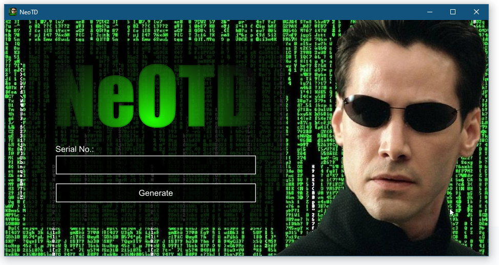

# NeoTD

This incredible software provided to you via C++ and these Win32 APIs: user32, gdi32, winmm.  
It features stunning visuals and audio. Very nostalgic.

This application is provided as a statically-compiled binary, so there is no installer.  
Simply download and run.

## Latest Release

### Version 1.0 2021-06-13

Platform | 32-bit | 64-bit
-|-|-
Windows | [Download](build/main.exe) | -
Mac | - | -
Linux | - | -